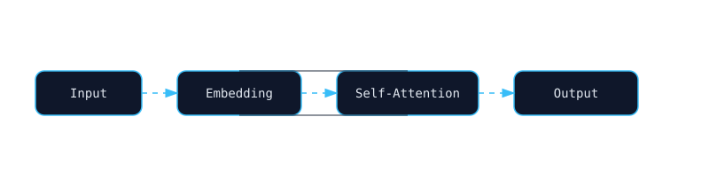

# 👋 Hi, I'm Raghav Upadhyay

<p align="center">
  
</p>

---

##  Transformer Flow

<p align="center">
  
</p>

---

##  About Me

* 🎓 IIIT Bhopal'27
<!-- * 🤖 ML Engineer/Data Scientist (NLP + Retrieval + Speech AI) -->
* 🧠 I build systems from **first principles → production scale**
<!-- * 🌐 Portfolio:  -->

---

##  What I Build

```text
Input → Embeddings → Attention → Reasoning → Output
```

* Representation Learning (Word2Vec, embeddings)
* RAG Systems (Vector DB + LLM orchestration)
* Neural Networks from scratch
* Real-time conversational AI
* Speech pipeline (VAD → ASR/STT → TTS)

---
<!-- 
## 🎛️ Live Dev Metrics

<p align="center">
  
  
  
</p>

---

## 📡 GitHub Activity Graph

<p align="center">
  
</p>

---

##  Stats Dashboard

<p align="center">
  
  
</p>

<p align="center">
  
</p> -->

---

##  Research Focus

* Mechanistic Interpretability
* Recommendation Systems
* Direct Speech-to-Speech Models

---

## 🎙️ Speech AI Stack

| Layer | Tech                         |
| ----- | ---------------------------- |
| VAD   | Silero / custom logic        |
| ASR   | Whisper / lightweight models |
| STT   | streaming pipelines          |
| TTS   | neural synthesis             |

---
##  How I Think About ML

I focus on understanding:

- How embeddings are actually computed  
- How gradients flow through networks  
- How retrieval systems scale  
- How to design AI systems beyond notebooks  

I care about internals, not just APIs.

---

##  Open To

- Machine Learning Engineer roles  
- Research Engineer roles  
- NLP Engineer roles  
- AI Systems roles 
- Data Scientist roles


##  Dev Thought

<p align="center">
  <!--STARTS_HERE_QUOTE-->
  <i>"Loading intelligence..."</i>
  <!--ENDS_HERE_QUOTE-->
</p>
---

##  Final

<p align="center">
  <i>Building intelligent systems, one layer at a time.</i>
</p>


<!-- 

 expiernce in research position   -->